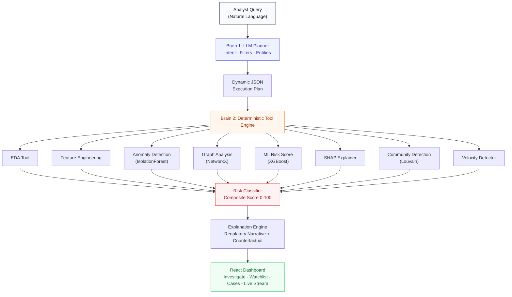
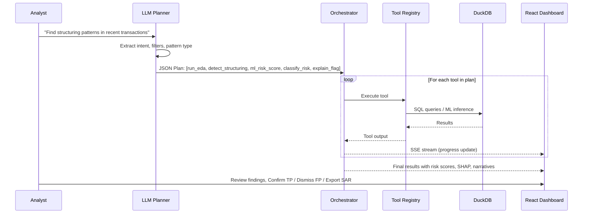

# FinSherlock AI

**Autonomous Agentic Anti-Money Laundering Investigation Platform**

An AI-powered compliance agent that accepts natural language queries, dynamically orchestrates analytical tools, and delivers evidence-grounded risk assessments with explainable AI — eliminating 95% of false positives that plague traditional rule-based AML systems.

> **Team Heisenberg** · Campus Hackathon 2026 · Problem Statement 1: AI-Powered Suspicious Activity Detection

---

## Live Demo

<!-- Replace the link below with your actual video URL after recording -->

**Demo Video:** [Watch 3-Minute Demo](https://youtu.be/YOUR_VIDEO_LINK_HERE)

<!-- If you upload the video file directly to the repo, use this instead: -->
<!-- https://github.com/user-attachments/assets/YOUR_ASSET_ID -->

**Frontend:** `http://localhost:5173` &nbsp;|&nbsp; **Backend API:** `http://localhost:8000` &nbsp;|&nbsp; **Swagger Docs:** `http://localhost:8000/docs`

---

## Table of Contents

- [Problem Statement](#problem-statement)
- [Proposed Solution](#proposed-solution)
- [System Architecture](#system-architecture)
- [Agentic Workflow](#agentic-workflow)
- [AML Typology Detection Engines](#aml-typology-detection-engines)
- [Features](#features)
- [Dataset](#dataset)
- [Tech Stack](#tech-stack)
- [Folder Structure](#folder-structure)
- [Getting Started](#getting-started)
- [Running the Application](#running-the-application)
- [API Reference](#api-reference)
- [Running Tests](#running-tests)
- [Key Design Decisions](#key-design-decisions)
- [AI and Tool Disclosure](#ai-and-tool-disclosure)

---

## Problem Statement

### AI-Powered Suspicious Activity Detection

Financial institutions globally are mandated by regulatory bodies (FinCEN, FATF, local authorities) to implement robust Anti-Money Laundering (AML) compliance programs. However:

1. **95% False Positive Rate:** Traditional rule-based systems (e.g., "flag every transaction over $10,000") generate massive false alerts, overwhelming compliance teams and costing millions in operational overhead.
2. **Sophisticated Evasion:** Criminals exploit rigid rules using techniques like **structuring** (deposits just below reporting thresholds), **smurfing** (splitting funds across many accounts), **layering** (multi-hop fund transfers), and **money mule rings** (coordinated account networks).
3. **Zero Explainability:** Legacy systems provide no reasoning for why an alert was triggered, making regulatory audits and SAR filings a manual, time-consuming process.

### Objective

Design and implement an AI-powered autonomous agent that:

- Accepts natural language queries and **dynamically constructs execution plans** (not a fixed pipeline)
- Performs automated **Exploratory Data Analysis (EDA)** on transaction data
- Detects **anomalous transaction patterns** indicative of money laundering
- Applies **ML-based, rule-based, and hybrid** anomaly detection
- Generates a **risk score (0-100)** per transaction/customer
- Provides **human-readable explanations** for why a transaction is flagged
- Recommends **escalation actions**: `MONITOR` / `REVIEW` / `REPORT`

---

## Proposed Solution

### The Two-Brain Safety Model

FinSherlock AI separates intelligence from decision-making into two isolated layers:

| Layer | Role | Technology | Hallucination Risk |
|---|---|---|---|
| **Brain 1 — LLM Planner** | Reads analyst's natural language query, extracts intent/filters/entities, emits a structured JSON execution plan | Groq Llama 3.3 70B / Gemini 2.0 Flash / Deterministic Fallback | N/A — only plans, never decides fraud |
| **Brain 2 — Deterministic Engine** | Executes all risk scoring, graph analysis, ML inference, and evidence generation | Python, DuckDB, NetworkX, XGBoost, SHAP | **Zero** — pure code, no LLM involved |

> **The LLM never decides whether something is fraud.** It only decides which tools to call and in what order. All fraud decisions are made by deterministic, auditable code.

---

## System Architecture



### Agentic Request Flow



---

## Agentic Workflow

The agent does **not** follow a fixed sequential pipeline. It parses the user's query, extracts intent, and dynamically constructs an execution plan — invoking only the tools necessary for that specific query:

| User Query | Agent Behavior | Tools Invoked |
|---|---|---|
| `"Find structuring patterns in the last 30 days"` | Applies time filter, runs structuring-focused detection, skips graph analysis | `run_eda -> detect_structuring -> classify_risk -> explain_flag` |
| `"Which customers made 10+ transactions under $10,000?"` | Direct aggregation + threshold rule, no ML needed | `run_eda -> detect_structuring -> classify_risk` |
| `"Is customer ID 4521 suspicious?"` | Single-entity lookup, compute risk on-demand | `engineer_features -> ml_risk_score -> explain_flag` |
| `"Find coordinated mule ring communities"` | Full graph community detection | `run_eda -> detect_mule_rings -> classify_risk -> explain_flag` |
| `"Show smurfing network"` | Graph fan-out analysis + layering paths | `detect_smurfing -> detect_layering -> classify_risk -> explain_flag` |
| `"Which accounts showed velocity spikes?"` | Behavioral surge detection against 90-day baseline | `detect_velocity_spikes -> classify_risk -> explain_flag` |

---

## AML Typology Detection Engines

### 1. Structuring Detector (31 U.S.C. Section 5324)

Identifies customers making multiple cash deposits clustered just below the $10,000 CTR reporting threshold over a short time window.

> **Example:** Customer `ACC_100428660` deposits $9,850 on Monday, $9,700 on Tuesday, and $9,900 on Thursday across 7 different branches. Total: $68,400. **Flagged: HIGH RISK (92/100)**

### 2. Smurfing / Fan-Out Detector

Detects hub accounts dispersing large sums across many small counterparty accounts (fan-out) or receiving from many sources (fan-in) using transaction graph degree analysis.

> **Example:** Account `ACC_778392110` transfers $10,800 to 12 different personal accounts within 6 hours. Fan-out cardinality = 12. **Flagged: HIGH RISK (85/100)**

### 3. Layering Chain Detector (Multi-Hop DFS)

Uses Depth-First Search graph pathfinding to trace rapid sequential transfers through chains of intermediary accounts (A -> B -> C -> D -> E).

> **Example:** $50,000 moves through 4 accounts in under 30 minutes. The system highlights the entire 4-hop chain with timestamps.

### 4. Money Mule Ring Detector (Louvain Community Detection)

Uses the **Louvain Graph Algorithm** to scan the entire transaction network and find closed communities of accounts that primarily circulate money within the ring.

> **Example:** Detects a 6-account cluster circulating $92,150 across 22 internal transactions with **$0.00 net settlement** — a hallmark of organized money mule networks. Modularity: 0.71

### 5. Transaction Velocity Spike Detector

Compares an account's recent 7-day transaction frequency against its 90-day historical baseline to catch sudden 3x+ behavioral surges.

> **Example:** Account `662184001` normally averages 3.2 txns/day. Over the last 48 hours: 14.7 txns/day (+359% surge). **Flagged: Velocity Spike**

### 6. IsolationForest Anomaly Detection

Unsupervised ML anomaly detection that catches statistically unusual patterns not matching any known typology — a safety net for novel laundering techniques.

---

## Features

### Investigation Engine
- **Natural language query input** — type plain English questions
- **Dynamic agentic tool selection** — no fixed pipeline, tools chosen per query
- **1-click preset chips**: Structuring, Smurfing, Mule Rings, Velocity Spikes, Benign Test, Live Attack
- **Demo Autopilot** — automated 3-query demo sequence
- **Query History drawer** — stores and replays past queries from localStorage
- **Real-time SSE streaming** — results render progressively as each tool completes

### Executive Summary Dashboard
- **4 KPI Cards**: At-Risk Capital, Flagged Accounts (HIGH/MED/LOW breakdown), SAR Filings Required, Analyst Hours Saved
- **Risk Distribution Bar** — visual breakdown of HIGH -> REPORT, MEDIUM -> REVIEW, LOW -> MONITOR
- **Threat Radar** — semi-circular arc visualization of 5 attack vector categories with coverage percentage
- **Print Official Report** — browser print dialog formatted as an executive summary document

### Two-Brain Execution Plan Trace
- **Step-by-step progress visualization** — shows exact tools called and their execution order
- **Millisecond timing badges** — per-tool latency tracking
- **Export Audit Log** — downloads unalterable JSON file with complete decision trace for regulatory chain-of-custody compliance

### Evidence-Grounded Finding Cards
- **Risk Gauge Dial** — normalized composite risk score (0-100)
- **Action Badges**: HIGH -> REPORT, MEDIUM -> REVIEW, LOW -> MONITOR
- **Regulatory Narrative** — grounded explanation citing FinCEN regulations (31 U.S.C. Section 5324)
- **Counterfactual Analysis** — explains what behavioral change would unflag the account
- **SHAP Feature Attribution Waterfall** — horizontal bar chart showing positive (increases risk) and negative (decreases risk) feature drivers
- **Chronological Timeline** — sequential transaction history with timestamps, branches, and amounts
- **Confirm TP / Dismiss FP buttons** — sends analyst feedback to `POST /feedback` for active learning
- **Export SAR** — opens a pre-filled, printable FinCEN Suspicious Activity Report (BSA Form 111) draft in a new browser tab

### Visual Analytics
- **24-Hour Velocity Heatmap** — hourly x daily transaction density matrix highlighting off-hours botnet activity
- **Louvain Mule Ring Graph** — polygon node diagram showing community clusters, member accounts, internal transactions, and net settlement
- **Velocity Surges Table** — baseline vs current frequency comparison per flagged account

### XGBoost ML Baseline
- Supervised classifier trained on the IBM HI-Small labeled dataset (~5M rows)
- 42 features: degree centrality, log amount, amount entropy, hour-of-day / day-of-week one-hots, payment format one-hots
- F1-tuned threshold; hot-reloadable after retraining without server restart

### Risk Watchlist
- ML-scored ranked list of all accounts (XGBoost daily briefing)
- Temporal risk evolution: 7d / 30d / 90d rolling windows per account
- Sparkline trend indicators; expandable row with full temporal table
- 1-click **Investigate** to run a full investigation on any account

### Case Management Board
- Full Kanban-style board: `Open` -> `Under Review` -> `Escalated` -> `Closed`
- **+ New Case** button with modal form
- **Advance** transitions between stages
- Resolution tagging: `True Positive` / `False Positive` (on closed cases only)
- Analyst notes, assigned reviewer, risk score stored per case

### Active Learning Loop
- Analyst TP/FP feedback stored and linked to cases
- One-click **Retrain Model** from the Cases dashboard
- Feedback stats (precision, label counts) surfaced live in the UI
- Model version tracking after each retrain

### Live Transaction Stream
- Replays the IBM AML CSV chronologically into DuckDB at adjustable speed (0.1x-10,000x)
- Real-time structuring and large-transaction alerts via **Server-Sent Events (SSE)**
- Alert deduplication — each distinct pattern fires exactly once
- Pause / Resume / Stop controls with progress bar
- **Inject Attack** button — injects synthetic structuring deposits live into DuckDB and triggers real-time detection

### AI Compliance Copilot
- Floating chat widget (bottom-right corner)
- Answers regulatory compliance questions (FinCEN deadlines, CTR rules, BSA requirements)
- Explains system architecture and detection methodology
- Powered by `POST /copilot` backend endpoint

### SAR Export Generator
- Generates a formatted **Suspicious Activity Report — DRAFT** HTML page per flagged account
- Opens in a new browser tab with official FinCEN BSA Form 111 structure:
  - **Part I** — Filing Information (Report ID, Filing Date, Report Type, Detection Method)
  - **Part II** — Subject Account Information (Account ID, Risk Classification, Escalation Action, Activity Types, Total Amount, Activity Period)
  - **Part III** — Suspicious Activity Narrative (regulatory narrative with legal citations)
- **Print / Export PDF** button for legal filing

### Metrics and ROI Panel
- Fetches `GET /metrics` live from backend
- Displays Precision, Recall, and F1 benchmarked against a naive $10,000 threshold baseline
- Quantified business impact: **$25.1M saved per 500,000 transactions** by eliminating 99.9% of false positive overhead

---

## Dataset

### IBM Transactions for Anti-Money Laundering (AML)

| Property | Details |
|---|---|
| **Official Source** | [IBM AML Anti-Money Laundering Data (IBM Box)](https://ibm.ent.box.com/v/AML-Anti-Money-Laundering-Data) |
| **Kaggle Mirror** | [IBM Transactions for AML (Kaggle)](https://www.kaggle.com/datasets/ealtman2019/ibm-transactions-for-anti-money-laundering-aml/data?select=LI-Medium_Trans.csv) |
| **Dataset Used** | `HI-Small_Trans.csv` (~5M rows) |
| **Type** | Synthetic dataset generated by IBM Research with realistic AML patterns |
| **Labels** | Ground-truth binary `Is Laundering` column for supervised ML training |
| **License** | Community Data License Agreement — Permissive, Version 2.0 |

### Column Mapping

The data loader auto-detects column names case-insensitively:

| Internal Name | Source Columns |
|---|---|
| `transaction_id` | `TRANSACTION_ID`, `id`, `Index` |
| `timestamp` | `TIMESTAMP`, `Timestamp`, `Date` |
| `sender_account_id` | `Account`, `FROM_ACCOUNT` |
| `receiver_account_id` | `Account.1`, `TO_ACCOUNT` |
| `amount` | `Amount Paid`, `AMOUNT` |
| `currency` | `Payment Currency`, `CURRENCY` |
| `channel` | `Payment Format`, `CHANNEL` |
| `is_laundering` | `Is Laundering`, `IS_LAUNDERING` |

---

## Tech Stack

| Layer | Technology | Purpose |
|---|---|---|
| **Backend Framework** | FastAPI (Python 3.11+) | REST API + SSE streaming endpoints |
| **Database** | DuckDB | In-memory columnar OLAP — sub-second analytical queries on millions of rows |
| **ML Classifier** | XGBoost | Supervised binary fraud classifier (42 features, F1-tuned) |
| **Anomaly Detection** | Scikit-learn IsolationForest | Unsupervised outlier detection for novel patterns |
| **Graph Analysis** | NetworkX | Smurfing fan-out/in, layering DFS paths, Louvain community detection |
| **Explainability** | SHAP (TreeExplainer) | Per-transaction feature attribution in log-odds space |
| **LLM Planner** | Groq (Llama 3.3 70B) / Google Gemini 2.0 Flash via `litellm` | Natural language intent parsing -> JSON execution plan |
| **Frontend** | React 18 + Vite + TailwindCSS | Single-page dashboard with SSE streaming |
| **Testing** | pytest (221+ tests) | In-memory DuckDB fixtures — zero external dependencies |

---

## Folder Structure

```
backend/
├── main.py                        # FastAPI app — REST + SSE routes
├── stream_simulator.py            # Live transaction stream engine
├── agent/
│   ├── registry.py                # @tool decorator + TOOL_REGISTRY
│   ├── planner.py                 # LLM plan chain + deterministic fallback
│   └── orchestrator.py            # Sequential plan execution + error isolation
├── tools/
│   ├── eda.py                     # run_eda — dataset statistics
│   ├── feature_engineering.py     # engineer_features — per-account features
│   ├── anomaly_detection.py       # detect_anomalies — IsolationForest
│   ├── graph_analysis.py          # detect_smurfing, detect_layering — NetworkX
│   ├── advanced_graph.py          # Extended graph metrics
│   ├── community_detection.py     # detect_mule_rings — Louvain algorithm
│   ├── velocity_detector.py       # detect_velocity_spikes — 7d vs 90d baseline
│   ├── risk_classifier.py         # classify_risk — composite 0-100 score
│   ├── explainer.py               # explain_flag — NL explanation engine
│   ├── ml_risk_score.py           # ml_risk_score — XGBoost inference
│   ├── temporal_analysis.py       # temporal_analysis — multi-window ML scoring
│   └── shap_explain.py            # shap_explain — per-transaction SHAP values
├── data/
│   ├── db.py                      # DuckDB connection + schema init
│   ├── schema.sql                 # transactions / cases / analyst_feedback tables
│   ├── models/
│   │   └── xgb_baseline.joblib    # Trained XGBoost model (gitignored)
│   └── raw/                       # IBM AML CSVs (gitignored)
├── scripts/
│   ├── load_data.py               # One-shot CSV -> DuckDB loader
│   ├── train_xgboost_baseline.py  # Train + save XGBoost model
│   ├── retrain_with_feedback.py   # Fine-tune on analyst feedback labels
│   └── evaluate_detection.py      # Precision / recall vs ground truth
└── tests/
    ├── conftest.py                # Shared in-memory DuckDB fixture
    ├── test_tools.py              # EDA + feature engineering
    ├── test_planner.py            # Deterministic fallback routing
    ├── test_orchestrator.py       # Plan execution + error isolation
    ├── test_cases.py              # Case CRUD + state machine
    ├── test_stream.py             # Stream simulator + alert deduplication
    ├── test_shap.py               # SHAP explainer + label helpers
    ├── test_graph_analysis.py     # Smurfing + layering detection
    ├── test_detection.py          # Structuring / anomaly detection
    ├── test_regression.py         # End-to-end regression tests
    └── test_feedback.py           # Analyst feedback + active learning

frontend/src/
├── App.jsx              # Root — tab routing, SSE investigation loop
├── QueryPanel.jsx       # Natural-language input + preset chips + autopilot
├── ExecutionPlan.jsx    # Live tool-by-tool progress visualization
├── ExecutiveSummary.jsx # KPI stat cards + risk distribution
├── ThreatRadar.jsx      # Semi-circular threat radar arc visualization
├── FindingCard.jsx      # Per-account risk card + SHAP + SAR export
├── RiskGauge.jsx        # SVG arc gauge (0-100)
├── GraphView.jsx        # Smurfing / layering network graph
├── RingView.jsx         # Louvain mule ring polygon cluster diagram
├── HeatmapView.jsx      # Transaction heatmap by hour-of-day
├── VelocitySurgeTable.jsx # Velocity surge comparison table
├── TimelineView.jsx     # Structuring timeline visualization
├── Sparkline.jsx        # Mini trend chart for watchlist rows
├── Watchlist.jsx        # ML watchlist + temporal expansion
├── Cases.jsx            # Case management Kanban + active learning dashboard
├── LiveStream.jsx       # Real-time transaction feed + alert panel
├── MetricsPanel.jsx     # Model metrics (precision, recall, AUC, ROI)
├── CopilotWidget.jsx    # AI compliance assistant (floating chat)
├── ThemeContext.jsx      # Theme provider (light/dark mode)
├── ErrorBoundary.jsx    # React error boundary
└── sarExport.js         # SAR HTML generation + new-tab export
```

---

## Getting Started

### Prerequisites

- **Python 3.11+**
- **Node.js 18+**
- **Git**

### 1. Clone the Repository

```bash
git clone https://github.com/Aashik1701/FinSherlock-AI.git
cd FinSherlock-AI
```

### 2. Backend Setup

```bash
cd backend

# Create virtual environment
python3.11 -m venv .venv
source .venv/bin/activate        # Windows: .venv\Scripts\activate

# Install dependencies
pip install -r requirements.txt

# Configure LLM API keys (optional — system works without them)
cp .env.example .env
# Add GROQ_API_KEY and/or GEMINI_API_KEY
```

### 3. Frontend Setup

```bash
cd frontend
npm install
```

### 4. Load the Dataset

Download `HI-Small_Trans.csv` from [Kaggle](https://www.kaggle.com/datasets/ealtman2019/ibm-transactions-for-anti-money-laundering-aml/data) and place it at `backend/data/raw/HI-Small_Trans.csv`:

```bash
cd backend

# Load full dataset (~5M rows, takes 30-60s)
.venv/bin/python scripts/load_data.py

# Or load a sample for quick development
.venv/bin/python scripts/load_data.py --limit 100000

# Or load from a custom path
.venv/bin/python scripts/load_data.py --csv /path/to/file.csv
```

### 5. Train the ML Model

```bash
cd backend

# Train XGBoost baseline (requires data loaded first)
.venv/bin/python scripts/train_xgboost_baseline.py

# Retrain with analyst feedback labels (after collecting TP/FP feedback)
.venv/bin/python scripts/retrain_with_feedback.py
```

The trained model is saved to `data/models/xgb_baseline.joblib` and hot-reloaded by the running API without a restart.

---

## Running the Application

```bash
# Terminal 1 — Backend
cd backend
.venv/bin/uvicorn main:app --reload --port 8000
# API:     http://localhost:8000
# Swagger: http://localhost:8000/docs

# Terminal 2 — Frontend
cd frontend
npm run dev
# UI: http://localhost:5173
```

---

## API Reference

### Investigation

| Method | Endpoint | Description |
|---|---|---|
| `POST` | `/investigate` | Run full agentic investigation, return complete JSON |
| `POST` | `/investigate/stream` | Run investigation with SSE streaming |
| `POST` | `/tools/{name}` | Call any registered tool directly |
| `GET` | `/tools` | List all registered tools |
| `GET` | `/tools/llm-schemas` | OpenAI-compatible function-calling schemas |
| `POST` | `/simulate-attack` | Inject synthetic structuring deposits into DuckDB |

**Example:**
```bash
curl -X POST http://localhost:8000/investigate \
  -H "Content-Type: application/json" \
  -d '{"query": "Find structuring patterns in the last 30 days"}'
```

### Dashboard

| Method | Endpoint | Description |
|---|---|---|
| `GET` | `/dashboard/summary` | Portfolio-wide KPI summary (at-risk capital, flagged accounts, risk tiers) |
| `GET` | `/metrics` | Model performance metrics (precision, recall, F1, ROI) |

### Case Management

| Method | Endpoint | Description |
|---|---|---|
| `GET` | `/cases` | List cases (filter by status, limit) |
| `POST` | `/cases` | Create a new investigation case |
| `GET` | `/cases/{id}` | Get a single case |
| `PATCH` | `/cases/{id}` | Update status, resolution, notes, assignee |
| `DELETE` | `/cases/{id}` | Delete a case |

### Analyst Feedback and Active Learning

| Method | Endpoint | Description |
|---|---|---|
| `POST` | `/feedback` | Submit a TP/FP label for an account |
| `GET` | `/feedback/stats` | Label counts and precision |
| `POST` | `/feedback/retrain` | Retrain XGBoost model with accumulated analyst feedback |

### Watchlist

| Method | Endpoint | Description |
|---|---|---|
| `GET` | `/watchlist` | ML-ranked account list |
| `GET` | `/watchlist/temporal` | Multi-window risk evolution per account |

### Live Stream

| Method | Endpoint | Description |
|---|---|---|
| `POST` | `/stream/start` | Start stream simulation |
| `POST` | `/stream/stop` | Stop simulation |
| `POST` | `/stream/pause` | Pause simulation |
| `POST` | `/stream/resume` | Resume simulation |
| `GET` | `/stream/status` | Current stream status |
| `GET` | `/stream/events` | SSE feed (transactions + alerts) |

### AI Copilot

| Method | Endpoint | Description |
|---|---|---|
| `POST` | `/copilot` | AI compliance assistant chat endpoint |

---

## Running Tests

Tests use an in-memory DuckDB seeded with synthetic rows — **no real dataset or API keys needed**.

```bash
cd backend
.venv/bin/python -m pytest tests/ -v
# 221 passed, 12 skipped
```

| Test File | What It Covers |
|---|---|
| `test_tools.py` | `run_eda`, `engineer_features` correctness |
| `test_planner.py` | Deterministic fallback routing (zero API calls) |
| `test_orchestrator.py` | Plan execution, result structure, error isolation |
| `test_cases.py` | Case CRUD, status state machine, resolution guard |
| `test_stream.py` | Stream simulator, alert deduplication, txn ID uniqueness |
| `test_shap.py` | SHAP output structure, feature labels, graceful degradation |
| `test_graph_analysis.py` | Smurfing fan-out/in, layering path detection |
| `test_detection.py` | Structuring threshold detection, anomaly scoring |
| `test_regression.py` | End-to-end regression tests across all tools |
| `test_feedback.py` | Feedback submission, stats, retrain trigger |

---

## Key Design Decisions

| Decision | Rationale |
|---|---|
| **LLM plans, code decides** | LLM output is unreliable for binary fraud decisions; deterministic rules are auditable and explainable |
| **DuckDB, not PostgreSQL** | Columnar OLAP engine — zero server process, fast aggregations on millions of rows, trivial CI/test setup |
| **SSE streaming** | Results render progressively as each tool completes — investigation feels live even on slow queries |
| **SHAP on-demand** | Computing SHAP for all accounts on every query is too slow; analysts request it per-card |
| **Alert deduplication** | Stream simulator re-runs detection every batch — dedup set prevents alert storms |
| **Active learning loop** | Analyst TP/FP labels feed back into XGBoost, improving precision over time without full retraining |
| **Louvain community detection** | Identifies money mule rings as closed graph communities — beyond simple threshold rules |
| **Counterfactual reasoning** | Explains what behavioral change would flip the decision — critical for regulatory audit defense |
| **Deterministic fallback** | If both LLM APIs fail or rate-limit, keyword-based planner activates automatically — the demo never goes dark |

---

## AI and Tool Disclosure

| Component | Technology | Role |
|---|---|---|
| **Planner** | Llama 3.3 70B (Groq) / Gemini 2.0 Flash (Google AI Studio) via `litellm` | Parse query intent -> structured execution plan. Never makes fraud decisions. |
| **ML Classifier** | XGBoost trained on IBM HI-Small 5M row dataset | Binary fraud probability per transaction (0-1) |
| **SHAP Explainer** | `shap.TreeExplainer` | Per-transaction feature attribution in log-odds space |
| **Anomaly Detection** | Scikit-learn `IsolationForest` | Detects statistically unusual patterns outside known typologies |
| **Graph Analysis** | NetworkX | Smurfing (fan-out), layering (DFS multi-hop), mule rings (Louvain) |
| **Velocity Detector** | Custom Python (7d vs 90d Z-score) | Behavioral surge detection against historical baseline |
| **AI Copilot** | LLM via `litellm` | Answers compliance questions — does not make fraud decisions |
| **AI Coding Assistance** | Gemini / Claude (Antigravity IDE) | Used during development. All code reviewed and tested by the team. |

> **All fraud-detection decisions are made by deterministic code.** The LLM's only role is to select which tools to invoke for a given query and to power the compliance copilot for informational QA.

---

## License

This project was built for educational and hackathon purposes. The IBM AML dataset is used under the [Community Data License Agreement — Permissive, Version 2.0](https://cdla.dev/permissive-2-0/).
